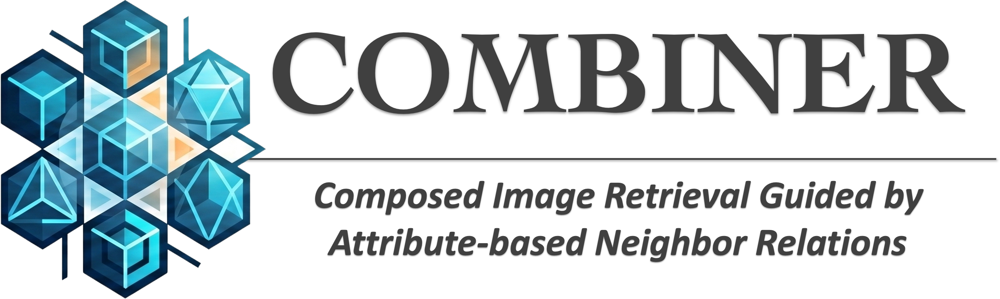
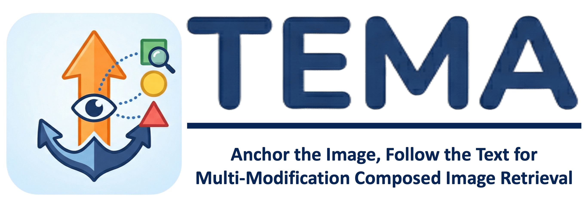
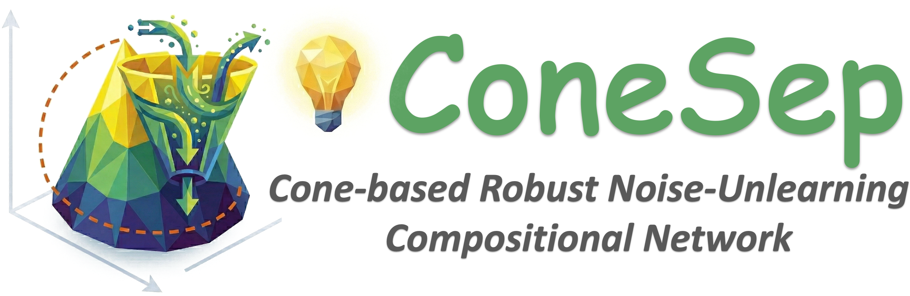
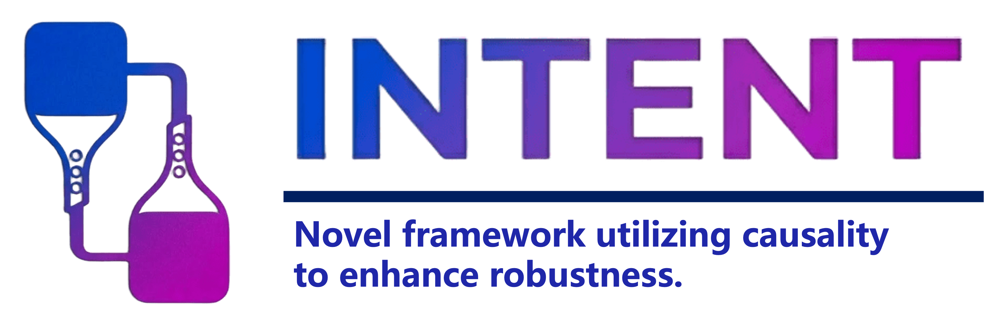
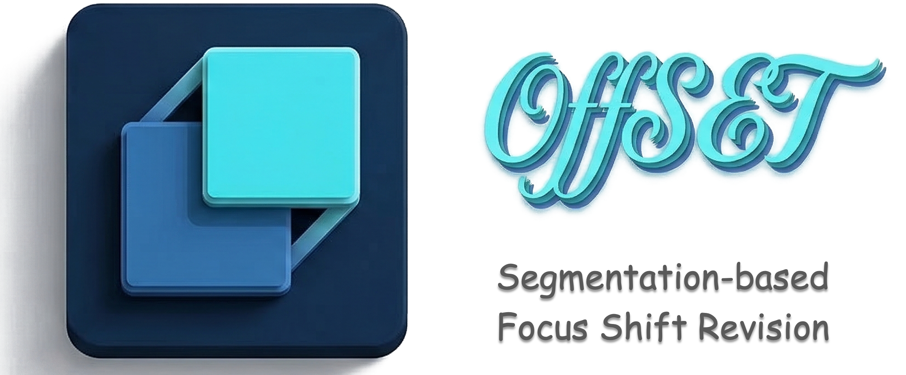

 







Hi, I am Zixu Li (李子旭).
=====
 
I am a Ph.D. student in Artificial Intelligence at [Shandong University](https://www.sdu.edu.cn), under the supervision of Prof. [Liqiang Nie](https://liqiangnie.github.io/index.html) and Prof. [Yupeng Hu](https://faculty.sdu.edu.cn/huyupeng1/zh_CN/index.htm). In 2023, I received my Bachelor's degree in Data Science and Big Data Technology from [Shandong University](https://www.sdu.edu.cn).

My research interests include *multimedia computing, information retrieval, and approximate nearest neighbor search*.

> I firmly believe in the power of open science. Currently, all the major projects I am involved in are fully open source.
> Additionally, as a member of the Intelligent Media Research Center (iLearn), all of our lab’s papers and code are open source. Please visit [iLearn Lab](https://github.com/iLearn-Lab) and feel free to share your valuable feedback.

> 作为开放科学的坚定拥趸，我致力于将研究成果开源，以促进社区的交流与发展。随时欢迎大家访问与交流探讨！
> 
> 💻 个人项目： 我主要参与的项目均已全面开源，欢迎访问我们的项目主页，非常期待您的真实反馈（欢迎提出 Issue 或 PR）！
> 
> 🏫 实验室组织： 我隶属于智能媒体研究中心 (iLearn)，实验室的论文代码与相关项目也已悉数开源，欢迎访问 [iLearn Lab](https://github.com/iLearn-Lab) 并提供宝贵意见。

#  Our open source projects

Here's the link to our repo! Feel free to check it out. Any feedback or support are always welcome. Thanks for taking a look! ✨
 

<table style="width:100%; border:none; text-align:center; background-color:transparent;">
  <tr style="border:none;">
      <td style="width:30%; border:none; vertical-align:top; padding-top:30px;">
       
      <b>COMBINER (TIP'26)</b> 
      
        <a href="https://ieeexplore.ieee.org/abstract/document/11534406" target="_blank">Paper</a> | 
        <a href="https://lee-zixu.github.io/COMBINER.github.io/" target="_blank">Project</a> | 
        <a href="https://github.com/Lee-zixu/COMBINER" target="_blank">Code</a>
      
    </td>
      <td style="width:30%; border:none; vertical-align:top; padding-top:30px;">
       
      <b>TEMA (ACL'26 Main)</b> 
      
        <a href="https://arxiv.org/abs/2604.21806" target="_blank">Paper</a> | 
        <a href="https://lee-zixu.github.io/TEMA.github.io/" target="_blank">Project</a> | 
        <a href="https://github.com/Lee-zixu/ACL26-TEMA" target="_blank">Code</a>
        <!-- <a href="https://ojs.aaai.org/index.php/AAAI/article/view/39507" target="_blank">Paper</a> -->
      
    </td>
    <td style="width:30%; border:none; vertical-align:top; padding-top:30px;">
       
      <b>ConeSep (CVPR'26)</b> 
      
        <a href="https://arxiv.org/abs/2604.20358" target="_blank">Paper</a> | 
        <a href="https://lee-zixu.github.io/ConeSep.github.io/" target="_blank">Project</a> | 
        <a href="https://github.com/Lee-zixu/ConeSep" target="_blank">Code</a>  |
        <a href="http://xhslink.com/o/2Cm9p4DMS1" target="_blank">Blog Post (Chinese)</a>
      
    </td>  
      </tr>
  <tr style="border:none;">
    <td style="width:30%; border:none; vertical-align:top; padding-top:30px;">
       
      <b>Air-Know (CVPR'26)</b> 
      
        <a href="http://arxiv.org/abs/2604.19386" target="_blank">Paper</a> | 
        <a href="https://zhihfu.github.io/Air-Know.github.io/" target="_blank">Project</a> | 
        <a href="https://github.com/ZhihFu/Air-Know" target="_blank">Code</a>  |
        <a href="http://xhslink.com/o/5oVjQ1a3apO" target="_blank">Blog Post (Chinese)</a>
      
    </td>  
     <td style="width:30%; border:none; vertical-align:top; padding-top:30px;">
       
      <b>HABIT (AAAI'26)</b> 
      
        <a href="https://arxiv.org/abs/2604.18037" target="_blank">Paper</a> | 
        <a href="https://lee-zixu.github.io/HABIT.github.io/" target="_blank">Project</a> | 
        <a href="https://github.com/Lee-zixu/HABIT" target="_blank">Code</a>
      
    </td>
    <td style="width:30%; border:none; vertical-align:top; padding-top:30px;">
       
      <b>ReTrack (AAAI'26)</b> 
      
        <a href="http://arxiv.org/abs/2604.17898" target="_blank">Paper</a> | 
        <a href="https://lee-zixu.github.io/ReTrack.github.io/" target="_blank">Project</a> | 
        <a href="https://github.com/Lee-zixu/ReTrack" target="_blank">Code</a>
      
    </td>
      </tr>
  <tr style="border:none;">
    <td style="width:30%; border:none; vertical-align:top; padding-top:30px;">
       
      <b>INTENT (AAAI'26)</b> 
      
        <a href="https://arxiv.org/abs/2604.18051" target="_blank">Paper</a> | 
        <a href="https://zivchen-ty.github.io/INTENT.github.io/" target="_blank">Project</a> | 
        <a href="https://github.com/ZivChen-Ty/INTENT" target="_blank">Code</a>
      
    </td>  
    <td style="width:30%; border:none; vertical-align:top; padding-top:30px;">
       
      <b>HUD (ACM MM'25)</b> 
      
        <a href="https://arxiv.org/abs/2512.02792" target="_blank">Paper</a> | 
        <a href="https://zivchen-ty.github.io/HUD.github.io/" target="_blank">Project</a> | 
        <a href="https://github.com/ZivChen-Ty/HUD" target="_blank">Code</a>
      
    </td>
    <td style="width:30%; border:none; vertical-align:top; padding-top:30px;">
       
      <b>OFFSET (ACM MM'25)</b> 
      
        <a href="https://arxiv.org/abs/2507.05631" target="_blank">Paper</a> | 
        <a href="https://zivchen-ty.github.io/OFFSET.github.io/" target="_blank">Project</a> | 
        <a href="https://github.com/ZivChen-Ty/OFFSET" target="_blank">Code</a>
      
    </td>
  </tr>
  <tr style="border:none;">
    <td style="width:30%; border:none; vertical-align:top; padding-top:30px;">
       
      <b>ENCODER (AAAI'25)</b> 
      
        <a href="https://ojs.aaai.org/index.php/AAAI/article/view/32541" target="_blank">Paper</a> | 
        <a href="https://sdu-l.github.io/ENCODER.github.io/" target="_blank">Project</a> | 
        <a href="https://github.com/Lee-zixu/ENCODER" target="_blank">Code</a>
      
    </td>

  </tr>
</table>

<!-- I warmly welcome academic discussions and potential collaborations. Please feel free to contact me if you are interested in my research or possible cooperation.

欢迎就我的研究方向展开学术交流与合作，如果您有相关研究兴趣或合作意向，欢迎随时联系我。-->

 
# 🔥 News
- *2026.06.10*: &nbsp;🎉🎉 I was honored to receive the Shandong University Graduate Academic Star Award (Practical Application Category, 18 people in the whole university).
- *2026.06.02*: &nbsp;🎉🎉 Thrilled to share that our team won the **1st Place**🏅 in the Reasoned-Aware Composed Video Retrieval (CoVR-R) Challenge at the VidLLMs Workshop @ CVPR 2026! Congratulations to all members!
- *2026.05.14*: &nbsp;🎉🎉 Thrilled to share that our team won **1st places**🏅✖️2, **2nd places**🥈✖️2, and **3rd place**🥉✖️1 across multiple Challenges (HD-EPIC, EPIC-KITCHENS, and EgoCross) at the EgoVis Workshop @ CVPR 2026! Congratulations to all members!
- *2026.04.30*: &nbsp;🎉🎉 One paper (COMBINER), was accepted by **TIP 2026**! Thanks to all co-authors!
- *2026.04.07*: &nbsp;🎉🎉 One paper (TEMA), was accepted by **ACL 2026 Main**! Thanks to all co-authors!
- *2026.03.17*: &nbsp;🎉🎉 One paper (STABLE), was accepted by **TKDE 2026**! Congratulations to all co-authors!
- *2026.02.21*: &nbsp;🎉🎉 Two papers (ConeSep, Air-Know), were accepted by **CVPR 2026**! Thanks and Congratulations to all co-authors!
- *2025.11.08*: &nbsp;🎉🎉 Three papers (ReTrack, INTENT, HABIT), were accepted by **AAAI 2026**! Thanks and Congratulations to all co-authors!
- *2025.10.18*: &nbsp;🎉🎉 As the project leader, I led our team won the **Grand Prize (特等奖)** in the CICAS Smart Power Scenario Competition. Congratulations to all team members!
- *2025.07.05*: &nbsp;🎉🎉 Two papers (OFFSET, HUD), were accepted by **ACM MM 2025**! Congratulations to all co-authors!
- *2024.12.10*: &nbsp;🎉🎉 One paper (ENCODER) was accepted by **AAAI 2025**! Thanks to all co-authors!
- *2024.09.13*: &nbsp;🎉🎉 I was honored to receive the **Huawei Outstanding Student Award (Top 30 globally per year)**, as well as the **Huawei Outstanding Technical Collaboration Award (Top 10 globally per year)**.

# 📝 Publications

⚓️ denotes project leader; 📧 denotes corresponding author.

<h1 style="font-size: 1.25em; font-weight: bold; margin-top: 35px; margin-bottom: 15px; border-bottom: 1px solid #eaecef; padding-bottom: 5px;">📝 Selected Publications</h1>

TIP 2026

  
**COMBINER: Composed Image Retrieval Guided by Attribute-based Neighbor Relations** [[Paper]](https://arxiv.org/abs/2606.04604) [[Project]](https://lee-zixu.github.io/COMBINER.github.io/) [[Code]](https://github.com/Lee-zixu/COMBINER) [[Official Version]](https://ieeexplore.ieee.org/abstract/document/11534406)

[***Zixu Li***](https://lee-zixu.github.io), [Yupeng Hu](https://faculty.sdu.edu.cn/huyupeng1/zh_CN/index.htm)✉, [Zhiwei Chen](https://zivchen-ty.github.io/), [Haokun Wen](https://haokunwen.github.io/), [Xuemeng Song](https://xuemengsong.github.io/), [Liqiang Nie](https://liqiangnie.github.io/index.html)

ACL 2026

**TEMA: Anchor the Image, Follow the Text for Multi-Modification Composed Image Retrieval** [[Paper]](https://arxiv.org/abs/2604.21806) [[Project]](https://lee-zixu.github.io/TEMA.github.io/) [[Code]](https://github.com/Lee-zixu/ACL26-TEMA)

[***Zixu Li***](https://lee-zixu.github.io), [Yupeng Hu](https://faculty.sdu.edu.cn/huyupeng1/zh_CN/index.htm)✉, [Zhiheng Fu](https://zhihfu.github.io), [Zhiwei Chen](https://zivchen-ty.github.io/), [Yongqi Li](https://liyongqi67.github.io/), [Liqiang Nie](https://liqiangnie.github.io/index.html)

 

CVPR 2026

**ConeSep: Cone-based Robust Noise-Unlearning Compositional Network for Composed Image Retrieval** [[Paper]](https://arxiv.org/abs/2604.20358) [[Project]](https://lee-zixu.github.io/ConeSep.github.io/) [[Code]](https://github.com/Lee-zixu/ConeSep) [[Official Version]](https://openaccess.thecvf.com/content/CVPR2026/html/Li_ConeSep_Cone-based_Robust_Noise-Unlearning_Compositional_Network_for_Composed_Image_Retrieval_CVPR_2026_paper.html)

[***Zixu Li***](https://lee-zixu.github.io), [Yupeng Hu](https://faculty.sdu.edu.cn/huyupeng1/zh_CN/index.htm)✉, [Zhiwei Chen](https://zivchen-ty.github.io/), [Mingyu Zhang](https://zh-mingyu.github.io/), [Zhiheng Fu](https://zhihfu.github.io), [Liqiang Nie](https://liqiangnie.github.io/index.html)

CVPR 2026

**Air-Know: Arbiter-Calibrated Knowledge-Internalizing Robust Network for Composed Image Retrieval** [[Paper]](http://arxiv.org/abs/2604.19386) [[Project]](https://zhihfu.github.io/Air-Know.github.io/) [[Code]](https://github.com/ZhihFu/Air-Know) [[Official Version]](https://openaccess.thecvf.com/content/CVPR2026/html/Fu_Air-Know_Arbiter-Calibrated_Knowledge-Internalizing_Robust_Network_for_Composed_Image_Retrieval_CVPR_2026_paper.html)
First-authored by undergraduate student

[Zhiheng Fu](https://zhihfu.github.io), [Yupeng Hu](https://faculty.sdu.edu.cn/huyupeng1/zh_CN/index.htm)✉, Qianyun Yang, Shiqi Zhang, [Zhiwei Chen](https://zivchen-ty.github.io/), [***Zixu Li***](https://lee-zixu.github.io)†

 

 

AAAI 2026

  
**ReTrack: Evidence-Driven Dual-Stream Directional Anchor Calibration Network for Composed Video Retrieval** [[Paper]](http://arxiv.org/abs/2604.17898) [[Project]](https://lee-zixu.github.io/ReTrack.github.io/) [[Code]](https://github.com/Lee-zixu/ReTrack) [[Official Version]](https://ojs.aaai.org/index.php/AAAI/article/view/39507) 

[***Zixu Li***](https://lee-zixu.github.io), [Yupeng Hu](https://faculty.sdu.edu.cn/huyupeng1/zh_CN/index.htm)✉, [Zhiwei Chen](https://zivchen-ty.github.io/), [Qinlei Huang](https://windlikeo.github.io/HQL.github.io/), Guozhi Qiu, [Zhiheng Fu](https://zhihfu.github.io), [Meng Liu](https://mengliu1991.github.io)

 

AAAI 2026

  
**HABIT: Chrono-Synergia Robust Progressive Learning Framework for Composed Image Retrieval** [[Paper]](https://arxiv.org/abs/2604.18037) [[Project]](https://lee-zixu.github.io/HABIT.github.io/) [[Code]](https://github.com/Lee-zixu/HABIT) [[Official Version]](https://ojs.aaai.org/index.php/AAAI/article/view/37608) 

[***Zixu Li***](https://lee-zixu.github.io), [Yupeng Hu](https://faculty.sdu.edu.cn/huyupeng1/zh_CN/index.htm)✉, [Zhiwei Chen](https://zivchen-ty.github.io/), Shiqi Zhang, [Qinlei Huang](https://windlikeo.github.io/HQL.github.io/), [Zhiheng Fu](https://zhihfu.github.io), [Yinwei Wei](https://weiyinwei.github.io)

 

AAAI 2025

**ENCODER: Entity Mining and Modification Relation Binding for Composed Image Retrieval** [[Paper]](https://ojs.aaai.org/index.php/AAAI/article/view/32541) [[Project]](https://sdu-l.github.io/ENCODER.github.io/) [[Code]](https://github.com/Lee-zixu/ENCODER) [[Official Version]](https://ojs.aaai.org/index.php/AAAI/article/view/32541)

[***Zixu Li***](https://lee-zixu.github.io), [Zhiwei Chen](https://zivchen-ty.github.io/), [Haokun Wen](https://haokunwen.github.io/), [Zhiheng Fu](https://zhihfu.github.io), [Yupeng Hu](https://faculty.sdu.edu.cn/huyupeng1/zh_CN/index.htm)✉, [Weili Guan](https://faculty.hitsz.edu.cn/guanweili)

 

Arxiv 2025

**FineCIR: Explicit Parsing of Fine-Grained Modification Semantics for Composed Image Retrieval** [[Paper]](https://arxiv.org/abs/2503.21309) [[Project]](https://sdu-l.github.io/FineCIR.github.io/)  [[Code]](https://github.com/SDU-L/FineCIR) 

[***Zixu Li***](https://lee-zixu.github.io),  [Zhiheng Fu](https://zhihfu.github.io),  [Yupeng Hu](https://faculty.sdu.edu.cn/huyupeng1/zh_CN/index.htm)✉,  [Zhiwei Chen](https://zivchen-ty.github.io/),  [Haokun Wen](https://haokunwen.github.io/),  [Liqiang Nie](https://liqiangnie.github.io/index.html)
 

<h1 style="font-size: 1.25em; font-weight: bold; margin-top: 45px; margin-bottom: 15px; border-bottom: 1px solid #eaecef; padding-bottom: 5px;">📝 More Publications</h1>

TKDE 2026

**STABLE: Efficient Hybrid Nearest Neighbor Search via Magnitude-Uniformity and Cardinality-Robustness** [[Paper]](https://www.computer.org/csdl/journal/tk/5555/01/11450508/2f5S8Le2iZ2)

Qianyun Yang, [Zhiwei Chen](https://zivchen-ty.github.io/), [Yupeng Hu](https://faculty.sdu.edu.cn/huyupeng1/zh_CN/index.htm), [***Zixu Li***](https://lee-zixu.github.io),  [Zhiheng Fu](https://zhihfu.github.io), [Liqiang Nie](https://liqiangnie.github.io/index.html)

 

ACM ToMM 2026

**REFINE: Composed Video Retrieval via Shared and Differential Semantics Enhancement** [[Paper]](https://dl.acm.org/doi/10.1145/3796712) [[Project]](https://sdu-l.github.io/REFINE.github.io/) [[Code]](https://github.com/iLearn-Lab/TOMM26-REFINE) [[Official Version]](https://dl.acm.org/doi/10.1145/3796712) 

[Yupeng Hu](https://faculty.sdu.edu.cn/huyupeng1/zh_CN/index.htm), [***Zixu Li***](https://lee-zixu.github.io), [Zhiwei Chen](https://zivchen-ty.github.io/), [Qinlei Huang](https://windlikeo.github.io/HQL.github.io/), [Zhiheng Fu](https://zhihfu.github.io), [Mingzhu Xu](https://faculty.sdu.edu.cn/xumingzhu/zh_CN/)✉, [Liqiang Nie](https://liqiangnie.github.io/index.html)

 

 

AAAI 2026

**INTENT: Invariance and Discrimination-aware Noise Mitigation for Robust Composed Image Retrieval** [[Paper]](https://arxiv.org/abs/2604.18051) [[Project]](https://zivchen-ty.github.io/INTENT.github.io/) [[Code]](https://github.com/ZivChen-Ty/INTENT) [[Official Version]](https://ojs.aaai.org/index.php/AAAI/article/view/39181) 

[Zhiwei Chen](https://zivchen-ty.github.io/), [Yupeng Hu](https://faculty.sdu.edu.cn/huyupeng1/zh_CN/index.htm)✉, [Zhiheng Fu](https://zhihfu.github.io), [***Zixu Li***](https://lee-zixu.github.io)†, [Jiale Huang](https://arcadiadream.github.io/HJL.github.io/), [Qinlei Huang](https://windlikeo.github.io/HQL.github.io/), [Yinwei Wei](https://weiyinwei.github.io)

 

ACM MM 2025

**OFFSET: Segmentation-based Focus Shift Revision for Composed Image Retrieval** [[Paper]](https://arxiv.org/abs/2507.05631) [[Project]](https://zivchen-ty.github.io/OFFSET.github.io/) [[Code]](https://github.com/ZivChen-Ty/OFFSET) [[Official Version]](https://dl.acm.org/doi/10.1145/3746027.3755366) 

[Zhiwei Chen](https://zivchen-ty.github.io/), [Yupeng Hu](https://faculty.sdu.edu.cn/huyupeng1/zh_CN/index.htm)✉, [***Zixu Li***](https://lee-zixu.github.io)†,  [Zhiheng Fu](https://zhihfu.github.io),  [Xuemeng Song](https://xuemengsong.github.io/), [Liqiang Nie](https://liqiangnie.github.io/index.html)

 

ACM MM 2025

  
**HUD: Hierarchical Uncertainty-Aware Disambiguation Network for Composed Video Retrieval** [[Paper]](https://arxiv.org/abs/2512.02792) [[Project]](https://zivchen-ty.github.io/HUD.github.io/) [[Code]](https://github.com/ZivChen-Ty/HUD) [[Official Version]](https://dl.acm.org/doi/10.1145/3746027.3755445) 
 

[Zhiwei Chen](https://zivchen-ty.github.io/), [Yupeng Hu](https://faculty.sdu.edu.cn/huyupeng1/zh_CN/index.htm)✉, [***Zixu Li***](https://lee-zixu.github.io)†, [Zhiheng Fu](https://zhihfu.github.io),  [Haokun Wen](https://haokunwen.github.io/), [Weili Guan](https://faculty.hitsz.edu.cn/guanweili)

<h1 style="font-size: 1.25em; font-weight: bold; margin-top: 45px; margin-bottom: 15px; border-bottom: 1px solid #eaecef; padding-bottom: 5px;">📝 Challenge Technical Report</h1>

CVPR 2026 Challenge 1st🏅

 

**R3: Composed Video Retrieval via Reasoning-Guided Recalling and Re-ranking** [[Technical Report]](https://arxiv.org/abs/2606.01113)

[***Zixu Li***](https://lee-zixu.github.io), [Yupeng Hu](https://faculty.sdu.edu.cn/huyupeng1/zh_CN/index.htm)✉, [Zhiheng Fu](https://zhihfu.github.io),  [Zhiwei Chen](https://zivchen-ty.github.io/), [Weili Guan](https://faculty.hitsz.edu.cn/guanweili), [Liqiang Nie](https://liqiangnie.github.io/index.html)

CVPR 2026 Challenge 1st🏅

 

**TempRet: Temporal Enhancement and Two-Stage Reranking for CVPR 2026 EPIC-KITCHENS-100 Multi-Instance Retrieval Challenge** [[Technical Report]](https://arxiv.org/abs/2605.24470)

[***Zixu Li***](https://lee-zixu.github.io), [Yupeng Hu](https://faculty.sdu.edu.cn/huyupeng1/zh_CN/index.htm)✉, [Zhiwei Chen](https://zivchen-ty.github.io/), [Zhiheng Fu](https://zhihfu.github.io),  Xiaowei Zhu, [Weili Guan](https://faculty.hitsz.edu.cn/guanweili), [Liqiang Nie](https://liqiangnie.github.io/index.html)

CVPR 2026 Challenge 1st🏅

 

**EgoAdapt: A Multi-Scene Egocentric Adaptation Method for CVPR 2026 HD-EPIC VQA Challenge** [[Technical Report]](https://arxiv.org/abs/2605.24500)

[Zhiwei Chen](https://zivchen-ty.github.io/), [Yupeng Hu](https://faculty.sdu.edu.cn/huyupeng1/zh_CN/index.htm)✉, [***Zixu Li***](https://lee-zixu.github.io)†, [Zhiheng Fu](https://zhihfu.github.io),  Guozhi Qiu, [Weili Guan](https://faculty.hitsz.edu.cn/guanweili), [Liqiang Nie](https://liqiangnie.github.io/index.html)

CVPR 2026 Challenge 2nd🥈

 

**OmniEgo-R2: A Routed Reasoning Framework for the 1st Cross-Domain EgoCross Challenge at CVPR 2026** [[Technical Report]](https://arxiv.org/abs/2605.24481)

[***Zixu Li***](https://lee-zixu.github.io), [Zhiwei Chen](https://zivchen-ty.github.io/), [Zhiheng Fu](https://zhihfu.github.io),  Wenbo Wang, [Yupeng Hu](https://faculty.sdu.edu.cn/huyupeng1/zh_CN/index.htm)✉, [Weili Guan](https://faculty.hitsz.edu.cn/guanweili), [Liqiang Nie](https://liqiangnie.github.io/index.html)

  

CVPR 2026 Challenge 3rd🥉

 

**EgoAction: Egocentric Action Composition with Reliability-Aware Temporal Fusion for the EPIC-KITCHENS Action Detection Challenge at CVPR 2026** [[Technical Report]](https://arxiv.org/abs/2605.24496)

[Zhiheng Fu](https://zhihfu.github.io),  [***Zixu Li***](https://lee-zixu.github.io)†, [Zhiwei Chen](https://zivchen-ty.github.io/), Fangxu Liu, [Yupeng Hu](https://faculty.sdu.edu.cn/huyupeng1/zh_CN/index.htm)✉, [Weili Guan](https://faculty.hitsz.edu.cn/guanweili), [Liqiang Nie](https://liqiangnie.github.io/index.html)

# 🔖 Patent 
- [国家发明专利授权, 第二发明人] 基于实体挖掘和修改关系绑定的组合图像检索方法及系统 - 授权专利号: *ZL202411903224.3*

- [国家发明专利实审, 第二发明人] 基于属性的邻域关系引导的组合图像检索方法及系统 - 申请号: *CN202511944904.4*

- [国家发明专利实审, 第二发明人] 基于共享和差异语义增强的组合视频检索方法及系统 - 申请号: *CN202511944910.X*

- [国家发明专利实审, 第二发明人] 基于互补性引导解耦的组合图像检索方法及系统 - 申请号: *CN202510142418.4*

- [国家发明专利实审, 第二发明人] 基于自适应中间粒度聚合网络的组合图像检索方法及系统 - 申请号: *CN202510274983.6*

- [国家发明专利实审, 第三发明人] 基于特征相似性和属性一致性协同约束的近似近邻混合检索的用户推荐方法及系统 - 申请号: *CN202311201790.5*

- [国家发明专利实审, 第三发明人] 一种基于分割焦点偏移修正的组合图像检索方法及系统 - 申请号: *CN202510143920.7*

- [国家发明专利实审, 第三发明人] 一种基于层次化不确定性感知消歧的组合视频检索方法及系统 - 申请号: *CN202511567477.2*

- [国家发明专利实审, 第四发明人] 面向开放域视觉语言多任务的自适应指代关系对齐的检索方法及系统 - 申请号: *CN202511944907.8*

<!-- - [发明授权, 第四发明人] 基于跨模态语义解析的图文检索方法及系统 - 授权专利号: *ZL202410326442.9*-->

<!-- - [发明授权, 第五发明人] 一种基于受挫随机游走和特征加权聚类的高校经济困难生识别方法及系统 - 授权专利号: *ZL202211425243.0*-->

# 🎖 Honors and Awards
- *2026.06* Shandong University Graduate Academic Star Award (Practical Application Category, 18 people in the whole university).
- *2025.10* **Grand Prize (特等奖)** in the CICAS Smart Power Scenario Competition.
- *2024.09* Huawei Outstanding Technical Collaboration Award **(Top 10 globally per year)**.
- *2024.09* Huawei Outstanding Student Award **(Top 30 globally per year)**.
- *2023.06* Outstanding Undergraduate Thesis **(Ranked 1st out of 409 candidates)**.
- *2023.06* Outstanding Graduates of Shandong Province.
- *2023.06* Outstanding Graduates of Shandong University.

<!--# 💻 Project QSGNGT-->

# 🏆 Competition
- 1st place 🏅, CVPR VidLLMs Workshop, Reasoned-Aware Composed Video Retrieval Challenge, 2026.
- 1st place 🏅, CVPR EgoVis Workshop, HD-EPIC Challenge, 2026. [[Link]](https://www.codabench.org/competitions/13645/#/results-tab)
- 1st place 🏅, CVPR EgoVis Workshop, EPIC-KITCHENS Challenge-Multi-Instance Retrieval Track, 2026. [[Link]](https://www.codabench.org/competitions/12008/#/results-tab)
- 2nd place 🥈, CVPR EgoVis Workshop, EgoCross Challenge-Source-Limited Track, 2026. [[Link]](https://www.codabench.org/competitions/11279/#/results-tab)
- 2nd place 🥈, CVPR EgoVis Workshop, EgoCross Challenge-Open-Source Track, 2026. [[Link]](https://www.codabench.org/competitions/13868/#/results-tab)
- 3rd place 🥉, CVPR EgoVis Workshop, EPIC-KITCHENS Challenge-Action Detection Track, 2026. [[Link]](https://www.codabench.org/competitions/13830/#/results-tab)

# 📖 Educations
- *2023.09 - now*, integrated Master-Ph.D. program in the School of Software, Shandong University. 
- *2019.09 - 2023.06*, Bachelor in the School of Software, Shandong University. 

# 📃 Services
- Conference PC Member: CVPR, ECCV, NeurIPS, AAAI, ACM MM, SIGIR, IJCAI, ICME, ICMR, ICASSP
- Journal Reviewer: TIP, TIFS, ToMM

 
 
 
 

 
 
 
 

